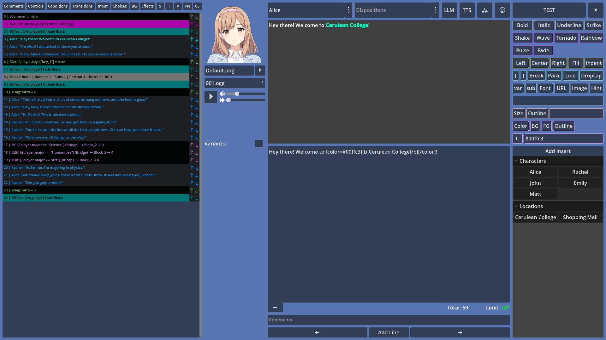
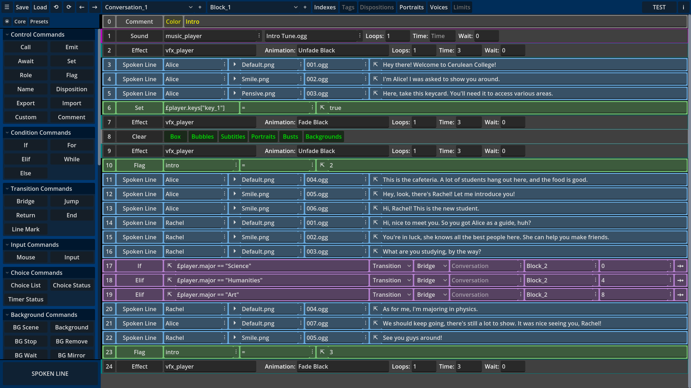

# Candy Dialogue Creator
**Candy Dialogue Creator by [Candy Arts](https://candy-arts.com) is the free, standalone companion application to [Candy Dialogue Engine](https://github.com/Candy-Arts/Candy-Dialogue-Engine).**

## Make dialogue writing a breeze
Candy Dialogue Creator provides a graphical user interface (GUI) to create, edit and translate dialogues with minimal typing and no special syntax.

It's capable of reading your Godot project folders, enabling you to fill data into dialogue lines by selecting from drop-down lists. This also allows you to preview image, audio or video files on mouse hover, so that you can quickly check that you're selecting the correct portraits, voice files, background images, musics, or cutscene videos.

It also offers various other features: an ergonomic Writer UI for writing and translating spoken lines, the ability to create line presets with pre-filled data, buttons for BBCode tags, and custom inserts to add text strings in one click.

You can export dialogues to your project folder for testing in just one click, select which parts of dialogues you want to import or export, merge dialogues, update older dialogue files, or append missing data.

## Teamwork
A number of features make Candy Dialogue Creator great for teams: unique settings profiles for each person and project, various options for merging dialogues or updating dialogues, and in-line annotations and comments. The fact that it works outside of the Godot editor makes it suitable for non-programmers, and ensures that writers or translators don't touch the project files directly.

## Use Options
Candy Dialogue Creator can be used in three different ways:
- For best performance, download and launch the executable for your operating system.
- To modify Candy Dialogue Creator as you see fit, download the source code as a raw Godot project, edit it, then compile.
- Or integrate the scripts, scenes and other resource files into your game to access the Candy Dialogue Creator at runtime, so you or your players can create and edit dialogues live in-game!

## Setup
### Executable
1. Download the executable for your operating system.
2. Unpack the downloaded compressed file to any location you want on your computer.
3. Read the Instructions.pdf file inside the folder.
4. Launch the executable.
5. It takes several seconds to load. You'll land on the profile menu. Create a new profile (give it a name that references the project it's for).
6. Click the profile in the list, then click the 'Select' button.
7. You'll arrive at the Main UI screen, where you can start adding lines to create a dialogue. But first, read the 'Quick Setup' guide in the Documentation folder to learn how to configure your profile.
- Read the 'Example Dialogue' guide in the Documentation folder to learn how to create a basic dialogue.
- The rest of the documentation will explain the remaining features.
- Don't forget to download [Candy Dialogue Engine](https://github.com/Candy-Arts/Candy-Dialogue-Engine) and integrate it to your project, otherwise dialogues won't work.

### Raw Project
1. Download the source code.
2. Unpack the downloaded compressed file to any location you want on your computer.
3. Open Godot and import the Candy_Dialogue_Creator folder as a project.
4. Open it, edit it as you want, run it from the Godot editor, or compile it.

### Integration (Advanced)
1. Download the source code.
2. Unpack the downloaded compressed file to any location you want on your computer.
3. In the Resources folder, delete the .import files.
4. In the Scripts folder, delete all the .uid files
5. Copy the Resources, Scenes and Scripts folders to your project root folder. **Do not modify this folder structure yet.**
6. Open your project in Godot. Let Godot import the files in those three folders.
7. You can now move the files in the Resources, Scenes and Scripts folders anywhere you want in your project files through the Godot editor's FileSystem panel.

You'll need to adapt the code to fit your project: don't display the profile menu at launch, etc. This depends on your project and what you want the Candy Dialogue Creator to be used for.

**When integrating Candy Dialogue Creator directly into your project, note that the UI is designed for resolutions of 1920x1080. If your project's resolution is smaller or has different proportions, you will need to adapt the UI.**

## Compatibility
Candy Dialogue Creator should work with any version of Godot 4.

Compiled executables are provided for Linux, Windows and MacOS, but you can compile for other systems supported by Godot. Note that the MacOS executable we provide is unsigned.

The interface is designed for a resolution of 1920x1080. Visual quality may degrade on lower resolutions. Devices with small screens (e.g. smartphones or small tablets) are not recommended.

## Project files access
Access to your Godot project files is not required, but some convenience features will be unavailable.

If direct access to the actual project files isn't possible, you can provide access to a copy of the project: Candy Dialogue Creator won't be able to export dialogues to your actual project directly, but all other features will work.

## Bugs and issues
Bugs should be reported here on Github.

We really don't expect security issues considering the nature of Candy Dialogue Creator, but if you find any, please [report them directly to us](https://candy-arts.com/index.php/contact/) (don't report them publicly: someone could exploit them).

## Feedback
We're looking forward to [user feedback](https://github.com/Candy-Arts/Candy-Arts/discussions/categories/candy-dc-features) to help us improve Candy Dialogue Creator!

All comments and suggestions are welcome, but we are currently considering a significant UI redesign to improve readability and ergonomy.

If you have any preferences or needs in this regard, please don't hesitate to share them with us.

